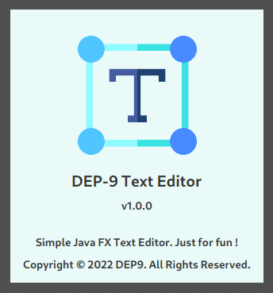
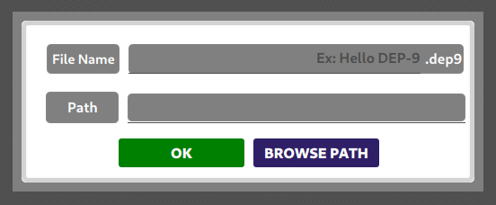
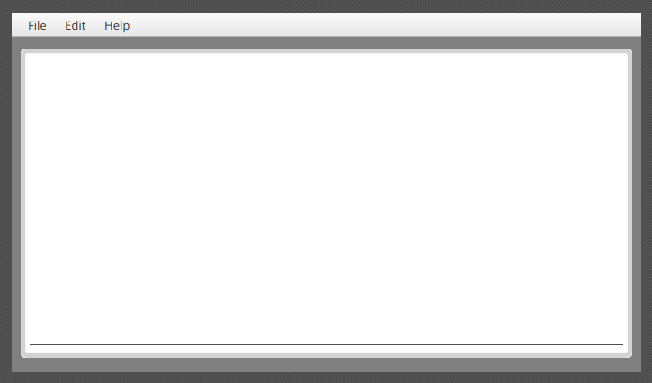

# DEP-9 Text Editor

#### A simple Java FX text editor

This is a simple Java FX text editor that can edit your text. 
The saved text files have the .dep9 file 
extension and this is the **only text editor** that can open, read and save the 
contents of .dep9 files.

The main key features of the **DEP-9** text editor as follows,

- It can open any type of plain text file and text files with .dep9 file extension.
- It is unique text editor which can open **.dep9 text files**.
- It can only save files with the .dep9 file extension.
- It has the printing facility.
- It has the cut, copy, past and select all basic text editing options.

## Splash Screen

## About Text-Editor Application

## Save Modal Window

## Text Editor User Interface

### Version
v1.0.0

### License
Copyright &copy; 2022 DEP9. All Rights Reserved. 
This project is licensed under the [MIT license](LICENSE.txt).